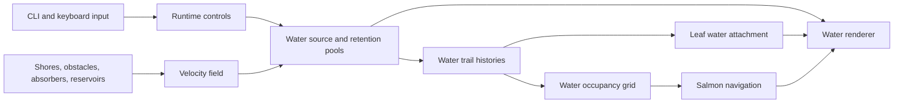

# Flow Lines v04

Python reference, behavioral specification, and working plan for a Godot 4
port of [`ink_flow_lines_v04.py`](ink_flow_lines_v04.py).

This document describes the current source, including polygon shorelines,
absorbers, rate-based reservoir release, salmon, and leaves. When this README
and the script disagree, the script is the source of truth.

## Current goals

The installation depicts a river as smooth ink-like trails moving through a
`16 × 9` world. Runtime elements alter the flow:

- Shores and solid obstacles repel and steer water.
- Absorbers consume a configurable fraction of passing trails.
- Reservoirs retain water independently of upstream spawning and release it at
  an aperture-controlled rate.
- Salmon swim upstream only where visible water exists.
- Leaves cross from either shore, attach only to water, and travel with it.

The Godot port should preserve these behaviors while making every element and
its parameters editable at runtime.

## Run the Python reference

From this directory:

```bash
python3 ink_flow_lines_v04.py
```

Set the initial normalized flow rate:

```bash
python3 ink_flow_lines_v04.py --flow-rate 0.5
```

`--flow-rate` accepts `0.0` through `1.0`. The script requires Python, NumPy,
and Matplotlib. Pillow is needed for GIF export; FFmpeg is needed for MP4
export.

## Keyboard controls

| Key | Current behavior |
| --- | --- |
| `0`–`9` | Set normalized flow to `digit / 9`. `0` stops new source flow; existing trails finish naturally. `9` gives 300 source trails and speed `10`. |
| `F12` | Save a timestamped `1920 × 1080` PNG in `ink_flow_screenshots_v04/`. |
| `S` | Release 25 salmon just beyond the right edge. |
| `L` | Queue 25 leaves from each shore, 50 total. |
| `G` | Open or close the active reservoir gate. |
| `[` | Narrow the active gate by `GATE_WIDTH_STEP`. |
| `]` | Widen the active gate by `GATE_WIDTH_STEP`. |
| `V` | Toggle obstacle, shore, absorber, and reservoir debug geometry. |

`S` and `L` are removed from Matplotlib's built-in keymaps before the custom
handlers are registered.

## World and timing model

| Property | Current value | Meaning |
| --- | ---: | --- |
| World size | `16 × 9` units | Final installation grid. |
| Patch size | `120 px` | One world unit. |
| Output | `1920 × 1080 px` | Exact backing canvas and screenshot size. |
| Coordinate origin | Bottom-left | Positive X is downstream; positive Y is upward. |
| Display rate | `30 FPS` | `DT = 1/30 s`. |
| Integration | 20 RK2 midpoint substeps/frame | Preserves smooth trajectories at high flow speed. |
| Source water slots | 300 | Maximum inlet trail target. |
| Reservoir slots | 100 | Independent retained-water capacity. |
| Water history | 1,200 points/slot | Stores the smooth trail. |
| Salmon pool | 300 | Recycles the oldest only when full. |
| Leaf pool | 300 | Recycles the oldest active or scheduled leaves when full. |

The Python world was originally seven units high. `WORLD_SCALE = 9 / 7` keeps
legacy spatial tuning visually consistent in the `16 × 9` world.

## System flow



## Behavioral specification

### Flow rate and spawning

- Flow is normalized from `0.0` to `1.0` and controls both source count and
  speed.
- Zero means zero source trails. Every positive rate has at least one trail.
- Positive rates map to approximately `round(300 × flow_rate)` source slots.
- Slot zero begins in the middle. New slots alternate above and below the
  middle without repositioning existing slots.
- Spacing is calculated against all 300 slots, giving the aligned wind-tunnel
  appearance at the inlet.
- Polygon shores determine the open inlet interval at `x = 0`; the spawn
  margin is applied inside that interval.
- New slots launch with `PARTICLE_LAUNCH_DELAY_MS` staggering.
- Reducing flow does not delete visible trails. Excess slots keep their old
  speed, finish their complete tails, and then stop respawning.

### Water motion and rendering

- Every active head receives base downstream flow, decorative curl noise,
  shore forces, obstacle forces, reservoir forces, and cached local separation.
- Each slot has a stable low-discrepancy speed offset in `±0.1` around the
  current core flow.
- Nearby source heads receive soft pressure so trails disperse after obstacles
  instead of collapsing onto one path.
- Final velocity is capped to the slot's flow-dependent maximum.
- Twenty midpoint samples are recorded per displayed frame. The history is
  drawn as one continuous, antialiased line with round caps and joins.
- A head that exits right retires; its slot is reused only after fewer than two
  trail samples remain visible.

### Shores and obstacles

- `ShorelinePolygon` represents solid land. All polygon edges contribute to
  water repulsion.
- `water_edge_indices` identifies only the water-facing chain used for leaf
  release and waterward normals.
- Water-edge indices must be forward-adjacent in the polygon's vertex order.
- Circular, rotated rectangular, and arbitrary non-self-intersecting polygon
  obstacles support radial repulsion plus a signed tangential `bend`.
- Polygon forces use nearest-boundary distance, winding-derived boundary
  normals, even-odd containment, and an emergency push for penetrations.

#### Drawing shoreline polygons

`vertices` describes the complete boundary of a solid land polygon, not an
open shoreline. The code automatically joins the last vertex back to the
first. Every resulting edge is shown when debug geometry is visible and every
edge contributes to collision forces. Put the non-water closure edges outside
the `16 × 9` canvas with `SHORE_POLYGON_MARGIN`; otherwise the automatic
closing segment can appear as an unintended second shore and steer water.

Vertex indices are zero-based. A polygon with ten vertices uses indices
`0` through `9`. `water_edge_indices` must contain at least two consecutive,
forward-adjacent indices from `vertices`. It marks the chain used to release
leaves and calculate waterward normals; it does not disable the polygon's
other collision edges.

For the default counterclockwise land polygons, order the visible edge as
follows:

- Bottom shore: right to left, producing waterward normals that point upward.
- Top shore: left to right, producing waterward normals that point downward.

This ordering is independent of the river's left-to-right flow. The `side`
field labels the shoreline for inlet and leaf behavior; it does not reorder
vertices or determine which side of an edge is land.

The following bottom shoreline encloses land that is wide at the bottom and
narrows toward a short plateau at `y = 3.5`. Its three closure edges remain
outside the visible canvas:

```python
ShorelinePolygon(
    vertices=(
        # Hidden outer land boundary
        (-SHORE_POLYGON_MARGIN, -SHORE_POLYGON_MARGIN),         # 0
        (WIDTH + SHORE_POLYGON_MARGIN, -SHORE_POLYGON_MARGIN),  # 1

        # Water-facing edge, ordered right to left
        (WIDTH + SHORE_POLYGON_MARGIN, 0.0),                    # 2
        (16.0, 0.0),                                            # 3
        (14.0, 0.0),                                            # 4
        (12.0, 0.7),                                            # 5
        (10.0, 1.4),                                            # 6
        (8.0, 2.1),                                             # 7
        (6.0, 2.8),                                             # 8
        (4.0, 3.5),                                             # 9
        (2.0, 3.5),                                             # 10
        (0.0, 3.5),                                             # 11

        # Hidden left closure
        (-SHORE_POLYGON_MARGIN, 3.5),                           # 12
    ),
    water_edge_indices=(2, 3, 4, 5, 6, 7, 8, 9, 10, 11),
    side="bottom",
    force_offset=BOTTOM_SHORE_Y_OFFSET,
)
```

To make the shoreline irregular, move, add, or remove points within the
water-facing chain while preserving its direction and adjacency. Keep the
complete polygon simple: its edges must not cross one another.

### Absorbers

- An absorber is an axis-aligned rectangle with an absorption fraction from
  zero to one.
- Selection is stable per water slot and absorber; it is not rerolled each
  frame.
- Selected trails receive a stable random stop depth inside the rectangle.
- Once stopped, the head contributes invalid history samples. The trail erases
  point by point instead of disappearing all at once.
- Unselected trails pass through unchanged.
- Absorbers operate on both source-water and reservoir-retained water slots.

### Reservoirs and gates

- Flow is assumed to travel left-to-right.
- The upstream diameter is open. The downstream semicircle is a wall except
  for the centered gate.
- When a source line is captured, its history and appearance are copied into a
  reservoir-only slot. The source slot immediately respawns upstream, so a
  reservoir never blocks new river flow.
- Color, width, speed offset, retirement speed, and attached leaves migrate to
  the retained copy.
- Retained trails circulate on stable, distributed orbit radii to avoid one
  dense clump.
- The current retained-water capacity is 100. If it fills, the oldest retained
  line is recycled.
- Gate aperture is `outlet_width / (2 × radius)`, clamped to `0…1`.
- Aperture controls release rate, not the final fraction released. At any
  nonzero open aperture, every retained line can eventually become ready.
- Readiness progress accumulates at
  `aperture × RESERVOIR_RELEASE_RATE`; each line has a random threshold from
  `0.5…1.5`.
- Lines captured while a gate is already open begin at randomized positions
  within that release cycle. This avoids an artificial startup pause while
  preserving the same long-term release rate.
- Readiness latches, but a ready trail still has to circulate to the physical
  gate before leaving.
- Closing or resizing a gate does not reset retained water.

### Salmon

- `S` releases exactly 25 salmon from just beyond the right edge.
- Spawn Y values are sampled from water reaching the downstream edge; the open
  channel is a fallback when no candidate exists.
- Salmon use the water velocity field with reversed direction while swimming
  upstream, and the normal direction after turning downstream.
- A `4 px` occupancy grid is dilated to a `10 px` water radius. Salmon look
  `8 px` ahead and may move only where that lookup reports water.
- Salmon never use leaf geometry as water.
- At a reservoir wall, `SALMON_RETURN_RATE = 0.75` turn downstream; the rest
  enter directly into the reservoir swirl. There is no gate delay.
- A salmon moving no more than `1 px` during a displayed frame is treated as
  stalled. Its old body is preserved and fading begins.
- Stranded salmon currently fade over `0.5 s`.
- Salmon trails are trimmed by accumulated arc length to approximately `50 px`.
- Upstream salmon are deleted only after their complete tail is left of the
  screen; returning salmon are deleted after their complete tail is right of
  the screen.

### Leaves

- `L` queues 25 leaves from the bottom shore and 25 from the top shore.
- The two cohorts receive shuffled time slots in one global sequence. Repeated
  key presses serialize after already queued leaves.
- The current release interval is `50 ms`.
- Scheduled leaves have no geometry and zero alpha; they are invisible before
  their individual release time.
- Release points are stratified across each explicit water-facing shore chain.
- Each leaf is rendered as a filled oval with a stable random major radius
  from `3…5 px`, a `0.6` minor-to-major aspect ratio, and a muted orange,
  ochre, or green color.
- Unattached leaves travel along the waterward shore normal, cross the complete
  screen, and clear the opposite edge if they never encounter water.
- Falling leaves sway left/right by a bounded `6…18 px`, with random periods
  from `1.2…2.8 s`.
- Every oval has a random clockwise or counterclockwise rotation of
  `0.1…1.0°` per simulation frame. Rotation continues after attachment and in
  reservoirs.
- Attachment checks occur every two displayed frames. Water histories are
  sampled every sixth point, always including the newest point.
- A leaf attaches to the nearest water sample within an inclusive `12 px`
  radius. It never attaches to salmon.
- An attached leaf follows a fixed logical rank in that water history. As the
  trail history advances, that binding carries the leaf downstream.
- If source water becomes reservoir water, the binding migrates to the nearest
  point in the retained copy.
- Leaves do not fade. They disappear only after clearing the opposite edge,
  reaching the right edge while attached, losing a deleted carrier, or being
  recycled from the 300-leaf pool.

## Configuration objects

The six Python dataclasses should become editable Godot resources or element
nodes.

| Type | Fields | Purpose |
| --- | --- | --- |
| `Obstacle` | `x`, `y`, `radius`, `strength`, `bend` | Circular solid with radial and tangential force. |
| `RectangleObstacle` | `x`, `y`, `width`, `height`, `angle_degrees`, `strength`, `bend`, `influence` | Rotated rectangular solid. |
| `PolygonObstacle` | `vertices`, `strength`, `bend`, `influence` | Arbitrary non-self-intersecting solid. |
| `ShorelinePolygon` | `vertices`, `water_edge_indices`, `side`, `strength`, `influence`, `power`, `force_offset` | Solid land, inlet boundary, and leaf-release edge. |
| `Absorber` | `x`, `y`, `width`, `height`, `absorption_fraction`, `stop_margin_fraction` | Rectangular field that consumes selected water trails. |
| `Reservoir` | `x`, `y`, `radius`, `outlet_width`, `gate_open`, `circulation`, force and orbit parameters | Circular retained-water system and live gate. |

Current configured scene:

- No active circular obstacles.
- One rotated rectangular obstacle.
- No active arbitrary polygon obstacles.
- Two straight default land polygons, one per shore.
- Nine `0.5 × 0.5` absorbers at `x = 3.5`, each absorbing 60 percent.
- One reservoir centered near `(11.57, 2.57)`.

## Principal tunable parameters

### World, pools, and integration

| Parameter | Current value | Effect |
| --- | ---: | --- |
| `GRID_COLUMNS`, `GRID_ROWS` | `16`, `9` | World dimensions and patch grid. |
| `PATCH_SIZE_PX` | `120` | Pixel scale per world unit. |
| `MAX_PARTICLES` | `300` | Full-flow source target. |
| `RESERVOIR_RETENTION_CAPACITY` | `100` | Independent retained-water slots. |
| `TRAIL_LENGTH` | `1200` | Samples stored per water trail. |
| `TARGET_FPS` | `30` | Simulation/display frame rate. |
| `SIMULATION_SUBSTEPS` | `20` | Smoothness and physics cost. |
| `PARTICLE_LAUNCH_DELAY_MS` | `10` | New-water staggering. |
| `RANDOM_SEED` | `None` | Set an integer for repeatable Python runs. |

### Water motion and appearance

| Parameter | Effect |
| --- | --- |
| `MAX_FLOW_SPEED`, `DEFAULT_FLOW_RATE` | User-facing velocity and initial normalized flow. |
| `PARTICLE_FLOW_VARIATION` | Stable speed variation around core flow. |
| `BASE_FLOW_X`, `BASE_FLOW_Y` | Base direction before all forces. |
| `NOISE_STRENGTH` | Curl amplitude. |
| `NOISE_SCALE` | Curl spatial frequency; larger means tighter features. |
| `NOISE_SPEED` | Curl animation rate. |
| `SHORE_EXIT_ANGLE_JITTER_DEGREES` | Maximum stable per-line rotation of shoreline repulsion; currently `±16°`. |
| `PARTICLE_SEPARATION_RADIUS` | Neighborhood for post-obstacle dispersion. |
| `PARTICLE_SEPARATION_STRENGTH` | Magnitude of separation pressure. |
| `PARTICLE_SEPARATION_X_SCALE` | Fraction of pressure retained along X. |
| `PARTICLE_SEPARATION_MAX_FORCE` | Per-line pressure cap. |
| `LINE_WIDTH_MIN`, `LINE_WIDTH_MAX` | Stable random water widths. |
| `COLORS`, `PARTICLE_ALPHA`, `BACKGROUND` | Water palette and canvas styling. |
| `SPAWN_X`, `SPAWN_Y_MARGIN` | Inlet position and shore clearance. |

### Shores, reservoirs, and outputs

| Parameter | Effect |
| --- | --- |
| `SHORE_INFLUENCE`, `SHORE_STRENGTH`, `SHORE_POWER` | Bank force range, magnitude, and falloff. |
| `BOTTOM_SHORE_Y_OFFSET`, `TOP_SHORE_Y_OFFSET` | Equal distance correction outside the visible frame. |
| `RESERVOIR_RELEASE_RATE` | Full-aperture readiness progress per second. |
| `RESERVOIR_RELEASE_THRESHOLD_MIN/MAX` | Per-line randomized readiness threshold. |
| `GATE_WIDTH_STEP`, `ACTIVE_RESERVOIR_INDEX` | Live gate controls. |
| `DEBUG_GEOMETRY_VISIBLE/COLOR/LINE_WIDTH` | Debug presentation. |
| `SAVE_MP4`, `SAVE_GIF`, `EXPORT_FRAMES` | Export switches. |
| `EXPORT_FPS`, `EXPORT_SECONDS` | Encoded duration and frame rate. |
| `SCREENSHOT_DIR`, `FRAME_DIR`, `OUTPUT_MP4`, `OUTPUT_GIF` | Output paths. |

### Salmon

| Parameter | Current value |
| --- | ---: |
| `SALMON_PER_RELEASE`, `MAX_SALMON` | `25`, `300` |
| `SALMON_LENGTH_PX`, `SALMON_LINE_WIDTH` | `50`, `2` |
| `SALMON_FADE_SECONDS` | `0.5` |
| `SALMON_HISTORY_POINTS` | `160` |
| `SALMON_MOTION_THRESHOLD_PX` | `1` |
| `SALMON_RETURN_RATE` | `0.75` |
| `SALMON_DAM_APPROACH_PX` | `14` |
| `SALMON_DAM_PASSAGE_SPEED_PX` | `180` |
| `SALMON_WATER_RADIUS_PX`, `SALMON_LOOKAHEAD_PX` | `10`, `8` |
| `WATER_GRID_CELL_PX` | `4` |

### Leaves

| Parameter | Current value |
| --- | ---: |
| `LEAVES_PER_SIDE`, `MAX_LEAVES` | `25`, `300` |
| `LEAF_RELEASE_INTERVAL_MS` | `50` |
| `LEAF_OVAL_RADIUS_MIN_PX/MAX_PX` | `3…5 px` |
| `LEAF_OVAL_ASPECT_RATIO` | `0.6` |
| `LEAF_OVAL_POINT_COUNT` | `20` |
| `LEAF_COLLISION_RADIUS` | `12 px` |
| `LEAF_FALL_SPEED_PX` | `120 px/s` |
| `LEAF_SWAY_AMPLITUDE_MIN_PX/MAX_PX` | `6…18 px` |
| `LEAF_SWAY_PERIOD_MIN_SECONDS/MAX_SECONDS` | `1.2…2.8 s` |
| `LEAF_ROTATION_MIN/MAX_DEGREES_PER_FRAME` | `0.1…1.0°`, random sign |
| `LEAF_WATER_SAMPLE_STRIDE` | `6` |
| `LEAF_ATTACHMENT_CHECK_INTERVAL` | `2 frames` |

## Runtime state

### Water arrays

| State | Meaning |
| --- | --- |
| `positions`, `trails` | Current heads and `400 × 1200` trail histories. |
| `particle_launch_times_ms` | Per-slot source/retention activation time. |
| `retiring`, `retirement_flow_rates` | Natural completion after exit or flow reduction. |
| `absorber_indices`, `absorption_target_x`, `absorbed` | Stable absorber assignment and pointwise erosion lifecycle. |
| `retained`, `retained_reservoir_indices`, `retention_birth_ms` | Reservoir-only slot ownership and recycling age. |
| `reservoir_release_progress/thresholds/ready` | Aperture-rate release state. |

### Salmon states

| State | Meaning |
| --- | --- |
| `UPSTREAM` | Travels against the water field. |
| `ENTERING` | Moves directly through the dam boundary into the swirl. |
| `RETREATING` | Travels downstream after turning around. |
| `fading` flag | Stopped because navigable water or adequate motion was lost. |

### Leaf states

| State | Meaning |
| --- | --- |
| `INACTIVE` | Free pool slot, invisible. |
| `SCHEDULED` | Fully configured but invisible until its release timestamp. |
| `FALLING` | Traverses the frame with sway and rotation while seeking water. |
| `ATTACHED` | Bound to one water slot and logical history rank. |
| `WAITING` | Temporarily lost a valid anchor and may reacquire nearby water. |

## Complete Python function reference

The source currently contains 64 top-level functions. Every function appears
once below. “Godot owner” is the proposed destination, not an existing class.

### CLI and flow mapping

| Python function | Responsibility | Godot owner |
| --- | --- | --- |
| `flow_rate_value(value)` | Parse and validate normalized CLI flow in `0…1`. | `FlowController` |
| `parse_cli_args()` | Declare and parse `--flow-rate`. | `FlowController` / startup |
| `particle_count_for_flow(flow_rate)` | Map zero to no trails and positive flow to `1…300`. | `WaterSystem` |

### Geometry and force field

| Python function | Responsibility | Godot owner |
| --- | --- | --- |
| `shore_force(points, particle_indices=None, apply_angle_jitter=True)` | Sum shoreline forces and apply stable per-line exit-angle variation to water. | `FlowField` |
| `safe_normalize(vectors, minimum)` | Return safe normalized vectors and true lengths. | `FlowMath` |
| `rectangle_vertices(obstacle)` | Convert a rotated rectangle to four world vertices. | `FlowMath` |
| `points_inside_polygon(points, vertices)` | Vectorized even-odd polygon containment. | `FlowMath` |
| `polygon_obstacle_force(...)` | Compute nearest-edge repulsion, bend, and penetration recovery. | `FlowField` |
| `particle_separation_force(points, particle_indices=None)` | Compute capped local pressure between source heads, using stable identity to split exact overlaps. | `WaterSystem` |
| `reservoir_gate_fraction(reservoir)` | Normalize outlet width to aperture `0…1`. | `ReservoirSystem` |
| `reservoir_force(...)` | Compute swirl, orbit confinement, wall, and outlet forces. | `ReservoirSystem` |
| `reservoir_pooling_mask(...)` | Identify heads retained rather than released by a reservoir. | `ReservoirSystem` |
| `curl_noise(points, time_value)` | Generate decorative time-varying sine curl. | `FlowField` |
| `velocity_field(...)` | Compose every force, optionally apply shore-angle variation, apply per-slot flow, and cap speed. | `FlowField` |

### Inlet and water lifecycle

| Python function | Responsibility | Godot owner |
| --- | --- | --- |
| `shoreline_spawn_channel()` | Find open-water Y bounds where shores cross the inlet. | `WaterSystem` |
| `alternating_spawn_y(particle_indices)` | Assign stable center/above/below inlet positions. | `WaterSystem` |
| `spawn_positions(particle_indices)` | Build inlet positions for selected slots. | `WaterSystem` |
| `reset_particles(indices)` | Respawn reusable slots and clear absorber/reservoir state. | `WaterSystem` |
| `deactivate_source_particles(indices)` | Free completed source slots without respawning. | `WaterSystem` |
| `deactivate_retained_particles(indices)` | Free retained slots and their dependent leaves. | `WaterSystem` |
| `claim_retention_slots(count, elapsed_ms)` | Claim free retained slots or recycle the oldest. | `ReservoirSystem` |
| `retain_source_particles(...)` | Copy captured source histories into reservoir storage and reopen sources. | `ReservoirSystem` |
| `transfer_new_reservoir_water(...)` | Detect and transfer source heads newly pooled by reservoirs. | `ReservoirSystem` |
| `update_reservoir_release_progress(...)` | Advance and latch aperture-rate readiness. | `ReservoirSystem` |

### Absorbers

| Python function | Responsibility | Godot owner |
| --- | --- | --- |
| `absorber_bounds(absorber)` | Return left, right, bottom, and top edges. | `AbsorberSystem` |
| `update_absorption_states(particle_indices)` | Select, constrain, stop, and begin eroding absorbed trails. | `AbsorberSystem` |

### Water lookup and salmon

| Python function | Responsibility | Godot owner |
| --- | --- | --- |
| `build_water_occupancy_grid()` | Rasterize and dilate visible water for salmon navigation. | `WaterSpatialIndex` |
| `points_have_water(points, water_grid)` | Query navigable water at proposed salmon points. | `WaterSpatialIndex` |
| `water_exit_y_candidates()` | Gather downstream water Y values for salmon spawning. | `SalmonSystem` |
| `release_salmon()` | Activate/recycle 25 salmon and initialize their state. | `SalmonSystem` |
| `trim_salmon_trail(slot)` | Limit one salmon body to approximately 50 px of arc length. | `SalmonSystem` |
| `resolve_salmon_reservoir_encounters(candidate_slots)` | Decide immediate return versus reservoir entry. | `SalmonSystem` |
| `update_entering_salmon(...)` | Move non-returning salmon directly into a selected reservoir. | `SalmonSystem` |
| `update_salmon(frame, frame_end_ms)` | Run salmon motion, water checks, stalls, fade, exits, and rendering state. | `SalmonSystem` |

### Shore sampling and leaves

| Python function | Responsibility | Godot owner |
| --- | --- | --- |
| `deactivate_leaves(indices)` | Clear every lifecycle, oval geometry, schedule, sway, spin, and binding field. | `LeafSystem` |
| `detach_leaves_from_water_slots(water_slots)` | Remove leaves whose carrier water is deleted. | `LeafSystem` |
| `migrate_leaf_attachments(source_slot, retention_slot)` | Rebind leaves to the nearest copied reservoir-history point. | `LeafSystem` |
| `shoreline_water_edge_geometry(shoreline)` | Validate explicit water edges and compute waterward normals. | `Shoreline2D` / `LeafSystem` |
| `clip_segment_to_viewport(start, vector)` | Clip a finite shore segment to the visible world. | `FlowMath` |
| `sample_shoreline_release_points(side, count)` | Stratify release points over one visible shore chain. | `LeafSystem` |
| `claim_leaf_slots(count)` | Claim inactive slots or recycle the oldest leaves. | `LeafSystem` |
| `refresh_leaf_collection()` | Transform filled ovals and apply visibility/colors. | `LeafRenderer` |
| `leaf_exit_targets(shore_points, waterward_normals)` | Project uncaught leaves beyond the opposite edge. | `LeafSystem` |
| `release_leaves()` | Queue both cohorts and assign timing, paths, oval radii, sway, spin, and color. | `LeafSystem` |
| `build_water_attachment_lookup()` | Build a water-only spatial index with exact slot/history identities. | `WaterSpatialIndex` |
| `attach_waiting_leaves(indices)` | Bind nearby falling/waiting leaves to water. | `LeafSystem` |
| `update_leaves(frame)` | Release, move, sway, rotate, attach, carry, and remove leaves. | `LeafSystem` |

### Drawing and live debug geometry

| Python function | Responsibility | Godot owner |
| --- | --- | --- |
| `create_obstacle_artists()` | Create debug artists for obstacles, shores, and absorbers. | `DebugGeometryRenderer` |
| `reservoir_arc_ranges(reservoir)` | Compute downstream wall arc spans around the gate. | `Reservoir2D` |
| `create_reservoir_artists(reservoir)` | Create reusable gate/wall arc artists. | `DebugGeometryRenderer` |
| `update_reservoir_artists(reservoir_index)` | Refresh wall spans and visibility after gate edits. | `Reservoir2D` / renderer |

### Frame loop, controls, and output

| Python function | Responsibility | Godot owner |
| --- | --- | --- |
| `update(frame)` | Orchestrate one complete water/leaf/salmon frame and redraw. | `FlowSimulation` |
| `init_animation()` | Initialize artists without advancing simulation. | `_ready()` / renderer setup |
| `take_screenshot()` | Save an exact-size timestamped PNG. | `CaptureService` |
| `set_flow_rate(flow_rate)` | Change source target while allowing excess trails to finish. | `FlowSimulation` public API |
| `report_gate_state(reservoir_index)` | Print live aperture and release-rate information. | `Reservoir2D` / debug UI |
| `set_gate_width(reservoir_index, outlet_width)` | Clamp gate width without resetting retained water. | `Reservoir2D` public API |
| `toggle_gate(reservoir_index)` | Toggle live gate state without resetting water. | `Reservoir2D` public API |
| `toggle_debug_geometry()` | Toggle all debug outlines. | `DebugGeometryRenderer` |
| `on_key_press(event)` | Dispatch keyboard commands and digit flow mapping. | `InputController` |
| `export_animation()` | Save optional MP4 and/or GIF output. | Godot Movie Maker or capture workflow |
| `set_interactive_window_size()` | Request an exact `1920 × 1080` Matplotlib canvas. | Fixed `SubViewport` setup |
| `main()` | Select export versus interactive execution. | Main scene/startup |

## Exact Python frame order

Order matters because several systems share water history identities.

1. Compute source-head separation once for the displayed frame.
2. For each of 20 substeps:
   1. Find launched, nonabsorbed water slots.
   2. Accumulate reservoir release readiness.
   3. Evaluate the velocity field at current positions.
   4. Evaluate it again at midpoint positions.
   5. Apply RK2 movement simultaneously.
   6. Update absorber assignments and stopping.
   7. Record a point, or an invalid point for already absorbed heads.
   8. Transfer newly pooled source water into retained slots.
3. Set frame-end simulation time.
4. Mark right-exiting water as retiring and detect hard escapes.
5. Commit the 20 new samples to every trail history.
6. Update leaves against the newly advanced histories.
7. Reset or recycle completed water slots.
8. Rebuild water occupancy and update salmon.
9. Push current histories and colors to all renderers.
10. Optionally save the displayed frame.

Updating leaves before water recycling is essential: leaves must see advanced
history, migrate with captured water, and never read a newly reused slot.

## Godot 4 core port

The first Godot implementation milestone now lives in
`godot_experiments/flow/`. It replaces the chevron/ring animation inside all
seven display scenes with independent instances of one shared
`FlowModel2D` scene.

Implemented in this milestone:

- Fixed 30 Hz simulation frames with 20 midpoint RK2 substeps.
- Source and reservoir-retention water pools with ring-buffer trails.
- Per-line flow variation, coherent curl motion, head separation, and
  shoreline exit-angle variation.
- Circle, rotated rectangle, polygon, shoreline, absorber, and reservoir
  geometry.
- Reservoir capture, distributed circular orbits, live gate state/width, and
  aperture-controlled release readiness.
- Inspector-editable typed resources plus atomic runtime parameter and
  geometry updates.
- A persistent UDP control bus with seven stable screen targets and backward
  compatibility for the existing controller's `speed` packets.
- Runtime debug geometry, keyboard flow/gate controls, and screenshots.

The core solver runs in Godot's fixed 2D physics loop, but deliberately uses
analytic soft-force geometry rather than `RigidBody2D` contacts. Rigid-body
responses cannot reproduce the reference model's influence fields,
circulation, absorbers, or trail histories.

Salmon and leaves are the next overlay milestone because both depend on stable
water-history identities. The complete runtime protocol, parameter list,
geometry schemas, and screen IDs are documented in
`godot_experiments/flow/GODOT_FLOW_RUNTIME.md`.

## Godot 4 architecture

The primary refactor is separation of configuration, hot simulation data,
rendering, and interaction. The Python module currently keeps all four as
globals.

```text
InkFlowDemo (Node2D)
├── FlowSimulation (Node)
│   ├── WaterSystem
│   ├── SalmonSystem
│   ├── LeafSystem
│   ├── WaterSpatialIndex
│   └── FlowElementRegistry
├── FlowElements (Node2D)
│   ├── Shoreline2D instances
│   ├── CircleObstacle2D instances
│   ├── RectangleObstacle2D instances
│   ├── PolygonObstacle2D instances
│   ├── Absorber2D instances
│   └── Reservoir2D instances
├── Renderers (Node2D)
│   ├── WaterTrailRenderer
│   ├── SalmonRenderer
│   ├── LeafRenderer
│   └── DebugGeometryRenderer
├── InputController
└── CaptureService
```

### Configuration resources

Use custom Godot `Resource` classes for serializable configuration and element
data. Resources expose typed properties in the Inspector and serialize to
version-control-friendly `.tres` files.

Suggested files:

- `InkFlowConfig.gd`: global timing, capacities, palettes, and tunables.
- `ShorelineConfig.gd`
- `CircleObstacleConfig.gd`
- `RectangleObstacleConfig.gd`
- `PolygonObstacleConfig.gd`
- `AbsorberConfig.gd`
- `ReservoirConfig.gd`

Runtime element nodes should use `@export` properties and emit a
`geometry_changed` signal. `FlowElementRegistry` should snapshot all geometry
once at the start of a physics tick; do not mutate geometry halfway through 20
substeps.

Give every reservoir a stable ID. Python array indices are sufficient for one
fixed scene, but indices would break retained-water and salmon references if
Godot later allows reservoirs to be inserted, removed, or reordered.

### Coordinate conversion

Keep simulation math in the Python coordinate system and convert only at the
renderer/editor boundary:

```gdscript
const PX_PER_WORLD := 120.0
const CANVAS_HEIGHT := 1080.0

func world_to_canvas(p: Vector2) -> Vector2:
    return Vector2(p.x * PX_PER_WORLD, CANVAS_HEIGHT - p.y * PX_PER_WORLD)

func canvas_to_world(p: Vector2) -> Vector2:
    return Vector2(
        p.x / PX_PER_WORLD,
        (CANVAS_HEIGHT - p.y) / PX_PER_WORLD
    )

func world_vector_to_canvas(v: Vector2) -> Vector2:
    return Vector2(v.x * PX_PER_WORLD, -v.y * PX_PER_WORLD)
```

This preserves polygon winding, waterward normals, and all tuned world-space
forces. Use a fixed `1920 × 1080` `SubViewport` for installation rendering and
screenshots; scale only the displayed viewport texture when the desktop window
has a different size.

### Fixed simulation clock

- Run the simulation at a fixed 30 Hz in `_physics_process()` or an explicit
  fixed-step accumulator.
- Preserve one `1/30 s` simulation frame and 20 midpoint substeps.
- Use simulation milliseconds for water launches, leaf release schedules, and
  salmon fades—not wall-clock time.
- Preserve fractional first-frame movement for a leaf released inside a
  33.3 ms tick.
- Apply runtime geometry changes between ticks.

### Hot data layout

Do not create one simulation node per particle. Use fixed pools and packed
arrays; renderers consume snapshots of those arrays.

Water recommendation:

- 300 source slots + 100 retained slots.
- Flat ring buffer of `400 × 1200` `Vector2` samples.
- Parallel validity buffer instead of Python `NaN` markers.
- One write cursor per slot.
- Packed arrays for position, launch time, retirement, absorber state,
  retention owner, release progress, and readiness.

Godot should expose helpers such as:

```text
append_sample(slot, point, valid)
get_logical_sample(slot, history_rank)
copy_logical_history(source_slot, destination_slot)
get_visible_history(slot)
```

A leaf binding must store a logical history rank. Python rolls each history
left while keeping the bound array index fixed; that fixed logical rank advances
the leaf downstream. Binding to a raw physical ring-buffer index would keep the
leaf on the wrong sample.

Salmon and leaves should also use fixed structure-of-arrays pools matching the
state tables above.

### Rendering strategy

Start with visual parity and profile before optimizing:

- Pool 400 `Line2D` nodes for water, with round joints/caps and stable random
  color/width.
- Pool 300 short `Line2D` nodes for salmon.
- Pool 300 filled oval nodes with stable per-release radii and rotation.
- Draw all debug geometry from one custom `Node2D._draw()` implementation.

Godot's `Line2D` supports packed point arrays, round joints/caps, antialiasing,
and closed outlines. Its documentation also notes that antialiased `Line2D`
meshes are not accelerated by batching, so the true worst case must be
profiled.

Matplotlib widths are points rather than pixels. At 120 DPI, approximate first
Godot values are:

- Water: `0.83…5 px` for Python widths `0.5…3`.
- Salmon and leaves: about `3.33 px` for Python width `2`.

If 400 frequently changing `Line2D` meshes cannot sustain 30 FPS, keep the
renderer interface and replace only the water backend with a custom dynamic
ribbon mesh or lower-level `RenderingServer` implementation. Do not begin by
discarding substep history samples; earlier coarse-segment tests visibly
damaged smoothness.

### InputMap actions

| Godot action | Default key |
| --- | ---: |
| `capture_screenshot` | `F12` |
| `release_salmon` | `S` |
| `release_leaves` | `L` |
| `toggle_debug_geometry` | `V` |
| `toggle_gate` | `G` |
| `narrow_gate` | `[` |
| `widen_gate` | `]` |
| `flow_0`…`flow_9` | `0`…`9` |

Use named InputMap actions rather than raw key checks inside the simulation
systems. For CLI parity, parse `--flow-rate` from Godot's user command-line
arguments during startup.

## Migration plan

1. **Freeze a deterministic Python baseline**
   - Set an integer `RANDOM_SEED`.
   - Save screenshots, selected head trajectories, force samples, and state
     counts for known scenarios.
2. **Build coordinates and editable elements**
   - Implement `16 × 9` world conversion, resources, element nodes, and debug
     drawing.
3. **Port core water**
   - Implement spawning, sine curl, forces, separation, RK2 integration, ring
     histories, natural flow changes, and smooth rendering.
4. **Port interaction elements**
   - Add all obstacle forms, absorbers, and reservoir retention/release.
5. **Port salmon**
   - Add water occupancy, upstream/return motion, dam choice, trail trimming,
     full-tail exits, and fading.
6. **Port leaves**
   - Add shore sampling, serialized invisible release, variable-radius ovals,
     sway, continuous spin, water-only attachment, and reservoir migration.
7. **Add runtime editing**
   - Expose transform and behavior fields and apply edits atomically at tick
     boundaries.
8. **Profile worst case**
   - Test 300 source water + 100 retained water + 300 salmon + 300 leaves at
     `1920 × 1080`.
   - The frame budget is `33.3 ms`; measure simulation and rendering
     separately.
9. **Tune against reference images**
   - Use image differences plus behavioral assertions rather than exact
     floating-point equality.

## Regression checklist for the Godot port

- [ ] Output surface and captures are exactly `1920 × 1080`.
- [ ] World-to-canvas conversion preserves polygon winding and shore normals.
- [ ] Flow zero has no new trails; every positive flow has at least one.
- [ ] Spawn order is center, above, below, and existing slots never shift.
- [ ] Reducing flow lets existing trails finish instead of deleting them.
- [ ] A full reservoir never blocks source spawning.
- [ ] Retention never exceeds 100 water trails.
- [ ] A half-open gate eventually releases every retained line.
- [ ] Readiness remains latched until a line physically reaches the gate.
- [ ] Absorbed trails stop at stable interior depths and erase point by point.
- [ ] Salmon move only where the water occupancy lookup permits.
- [ ] Salmon make one immediate return/entry choice at each reservoir.
- [ ] Stalled salmon preserve their body and fade over the configured time.
- [ ] Salmon are removed only after the complete tail leaves.
- [ ] Leaf cohorts contain exactly 25 releases per shore.
- [ ] Scheduled leaves are invisible and rapid key presses remain serialized.
- [ ] Uncaught leaves cross the center and clear the opposite edge.
- [ ] Leaf sway is bounded and oval radii remain stable within `3…5 px`.
- [ ] Leaf spin remains `0.1…1.0°/frame` with a stable random sign.
- [ ] Leaves attach only to water, never salmon.
- [ ] Leaves migrate from source water to retained reservoir water.
- [ ] Leaves never fade.
- [ ] Smooth lines retain the visual quality of the Python reference at 30 FPS.

## Open design questions for discussion

1. Should the first Godot build use 400 pooled `Line2D` nodes for fastest
   parity, or start directly with a custom water renderer?
2. Should the installation render at 30 Hz, or simulate at 30 Hz and interpolate
   into a 60 Hz display?
3. Should obstacle editing happen only through the Inspector, or also through
   visible drag/rotate/resize handles in the running installation?
4. Should level layouts live entirely in `.tscn` scenes, external `.tres`
   resources, or a scene plus reusable resource library?
5. Is distribution-level randomness sufficient, or do we need a PCG64-compatible
   generator for exact Python/Godot seeded parity?
6. Should reservoir retention capacity stay global at 100, or become a
   per-reservoir limit?

## Current implementation choices to revisit

These are descriptions of the Python reference, not necessarily requirements
for the Godot version:

- Retained reservoir water normally follows the live global flow rate. Setting
  flow to zero can therefore stop retained lines indefinitely; a retained copy
  made from an already-retiring source is the exception because it preserves
  that source's retirement speed.
- The 100 retained-water slots form one global pool shared by every reservoir,
  and the oldest retained line is recycled when that pool is full.
- Only reservoir index zero is connected to the live gate controls. There is
  no runtime reservoir-selection control yet.
- Releasing more than 300 leaves before earlier scheduled leaves appear can
  recycle those invisible queued slots. The global release clock still keeps
  its old reservations, which can create a pause before the replacement cohort.
- An attached leaf is removed when its center reaches `x = WIDTH`, rather than
  waiting for the complete rotated outline to clear the screen.
- Deleting a carrier water slot immediately deletes any leaf attached to it.
  An alternative Godot behavior could detach the leaf and resume free motion.

## Godot references

- [Line2D class](https://docs.godotengine.org/en/stable/classes/class_line2d.html)
- [Godot resources](https://docs.godotengine.org/en/stable/tutorials/scripting/resources.html)
- [InputMap and input examples](https://docs.godotengine.org/en/stable/tutorials/inputs/input_examples.html)
- [Engine fixed-tick settings](https://docs.godotengine.org/en/stable/classes/class_engine.html)
- [Viewport screenshot pattern](https://docs.godotengine.org/en/stable/classes/class_viewport.html)
