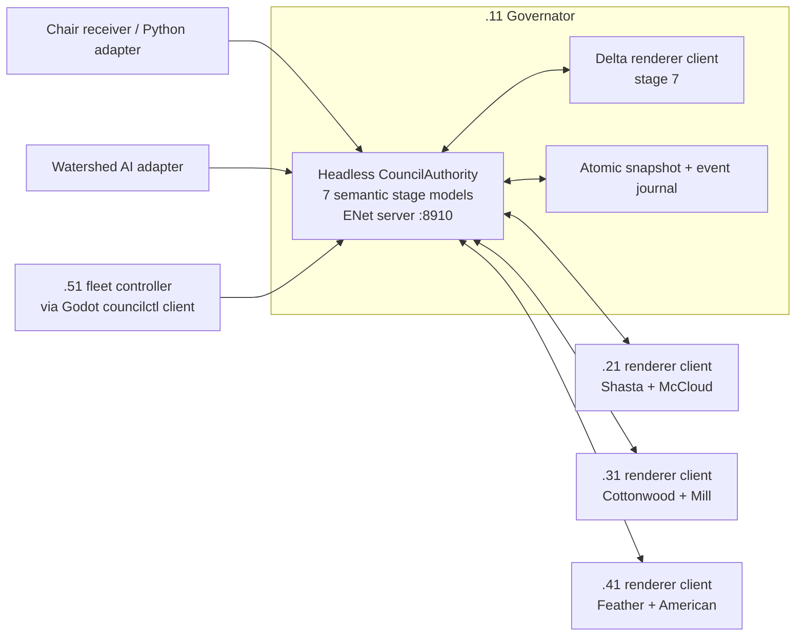

# Water Council Central Authority and Multiplayer Refactor

Status: proposed architecture; no live deployment changes

This plan replaces four independent Godot simulation authorities plus the
UDP/Python confluence workaround with one semantic authority on `.11` and one
Godot rendering client per Mac. It preserves the current GPU renderer, fixed
particle pools, symbolic stage topology, two-window hosts, atomic deployment,
and the ability to fall back to the working UDP system during migration.

## Decision

Run a separate, headless Godot authority process on `.11`. It owns the model for
all seven stages whether or not their display processes are running. The Delta
renderer on `.11` is a client of that authority, just like the three two-screen
renderers on `.21`, `.31`, and `.41`.

Use `ENetMultiplayerPeer` and `SceneMultiplayer` for connected transport, but
use a small versioned application protocol carried by `SceneMultiplayer.send_bytes()`.
Do not replicate scene trees or GPU nodes and do not stream particle positions.

The architectural split is:

- The authority owns facts, schedules, revisions, transit, and delivery.
- Render clients own windows, pixels, shaders, bounded GPU pools, and visual
  realization.
- Fleet tools own installation, process lifecycle, display configuration, and
  health checks. They do not own model state.
- Python remains an adapter for chair hardware, Watershed AI, and the legacy
  protocol during migration. It stops synthesizing canonical water or particle
  state once the authority takes over.

This is a deep refactor, but it should be made as a sequence of reversible
authority moves rather than a rewrite of the renderer.

## The important distinction

"All seven stages run on Delta without rendering" should mean seven lightweight
semantic `StageModel` instances in the headless authority. It should not mean
instantiating seven copies of `scene_N.tscn` or the GPU stage on `.11`.

The current production stages build render viewports, particle buffers,
materials, overlays, windows, and GPU-only simulations. Those are the wrong
objects for a central server. The refactor should extract pure model services
from the large stage script and leave the existing scene as a renderer of a
versioned `StageViewState`.

This also means that `.21` can be offline while its Shasta and McCloud semantic
models continue to advance on `.11`. Delta still receives their authoritative
water, widths, and scheduled ecology. When `.21` reconnects, it receives a full
current snapshot; it does not become a second authority.

## Why the present system needs this boundary

Today, "global" means one Godot process, not the fleet:

- `ModelTimeline` and `ModelRegimes` are process-persistent autoloads. The two
  stages on one Mac share them, but different Macs advance independent copies.
- `FlowControlBus` accepts and queues stage control on each process. For those
  actions, its immediate ACK proves queue acceptance rather than frame-boundary
  application. Process-global regime changes are applied before ACK, and the
  controller already retries/polls returned state until important regime/date
  fields converge; that useful verification should be retained.
- `ParticleConfluenceBus` adds in-memory sessions, retries, deduplication, and
  event queues on every process.
- The Python bridge on `.11` polls UDP 5005, derives water state, simulates one
  screen of transit, injects Delta on loopback 5007, and relays particle events
  in both directions.
- Timeline, regime ecology, pollution cadence, release days, and Watershed AI
  state are partly embedded in each renderer.
- All durable-looking confluence ledgers are actually RAM-only. Restarting a
  producer, bridge, or receiver changes the failure semantics.

The current topology and rendering contracts are strong and should survive:

- one process on `.11` for Delta;
- one process and two native windows on each of `.21`, `.31`, and `.41`;
- exact symbolic stage IDs and host ownership;
- symbolic confluence routes resolved to pixels only by the Delta renderer;
- fixed GPU pool capacities with no per-frame allocation;
- no GPU particle readback;
- water as repeated absolute state and ecology as typed semantic batches;
- salmon cohorts of exactly 25 with a named destination and a predetermined
  survivor count;
- leaves and pollution conserved as command counts, not claimed observed exits;
- current atomic stage/import/checksum/promote/rollback deployment behavior.

## Target process topology



There is one ENet client connection per Godot render process, not per display.
The `.21`, `.31`, and `.41` clients each lease two symbolic screens over their
single connection. The Delta renderer uses a separate process and connects to
the authority locally. `.51` may connect as a read-only observer/operator, but
it never owns a stage.

The authority is deliberately separate from the Delta renderer. A display,
Metal, window, or shader crash must not stop the model or invalidate the other
six screens.

## One deployment manifest

Create one versioned manifest consumed by Godot and the Python fleet tools. It
replaces the duplicated topology in `godot_controller.py`,
`confluence_water_bridge.py`, and `confluence_topology.gd`.

The manifest should contain:

- logical node ID;
- fleet/data address and one or more management addresses;
- stable SSH host-key alias and login account;
- installed project and persistent state paths;
- exact owned screen IDs;
- authority address, port, and schema range;
- persistent display IDs, expected resolution, rotation, origin, and stage
  assignment;
- expected process role and command line;
- renderer capacity limits;
- release ID and immutable data/config hashes.

Fleet Ethernet and Thunderbolt management are separate concepts. For `.11`,
`196.168.50.11` remains the application address while a verified link-local
Thunderbolt address may be an SSH/deployment fallback. Neither should be
silently substituted for the other.

Production must reject a missing display or a one-screen preview fallback.
Display indices are volatile; readiness should verify persistent display IDs
and the exact `displayplacer` extended layout before launching Godot.

## Authority components

The headless project should contain small services with no dependency on
`Node2D`, `Window`, `SubViewport`, `RenderingServer`, or GPU resources.

| Component | Authoritative responsibility |
| --- | --- |
| `CouncilAuthority` | lifecycle, fixed tick, epoch, revision, transaction boundary |
| `CouncilStateStore` | current canonical state, atomic snapshot, recovery |
| `CouncilNetworkServer` | ENet sessions, authentication, leases, snapshots, ACKs |
| `TopologyService` | manifest ownership and legal source/destination routes |
| `TimelineService` | one model clock, pause, date anchor, year duration |
| `RegimeService` | one active regime set, exclusivity, profiles, effective features |
| `HydrologyService` | all seven flow, speed, count, width, temperature, basin, tide outputs |
| `TransitService` | screen-distance delays and Delta confluence view state |
| `EcologyScheduler` | salmon, leaf, and pollution semantic release commands |
| `EventJournal` | monotonic IDs, due ticks, ACK state, retry, expiry, replay cursors |
| `InputService` | validated chair, operator, and Watershed AI proposals |
| `HealthService` | peer freshness, applied revisions, displays, queue depth, build hashes |

The authority advances at a fixed semantic tick, recommended initially at
10 Hz. Rendering remains 30 FPS. Hydrology/state frames may be published at
5 Hz because the current bridge already operates at that rate. Ecology and
calendar boundaries are evaluated only by the authority, never independently
by clients.

## Canonical state

The complete authority snapshot should be serializable without a scene tree.
A conceptual version 1 shape is:

```json
{
  "protocol": "water-council-mp/1",
  "schema_version": 1,
  "installation_id": "water-council",
  "authority_epoch": 42,
  "authority_session": "uuid",
  "revision": 18321,
  "tick": 91840,
  "release_id": "git-or-build-hash",
  "data_manifest_hash": "sha256",
  "timeline": {},
  "regimes": {},
  "chair_state": {},
  "watershed_ai": {},
  "stage_state_by_screen": {},
  "delta_confluence": {},
  "ecology_cursors": {},
  "client_leases": {}
}
```

The model owns dynamic values such as:

- model day, minute, phase, pause, and year duration;
- active regimes and their one fleet-wide revision;
- chair occupancy, freshness, and selected regime transition;
- current and last-successful Watershed AI decision;
- per-screen flow rate, active-head target, speed, exit width, temperature,
  gate state, basin inputs/extractions, and effective feature state;
- the 97-value Delta tide view model or another bounded render-ready tide
  representation;
- delayed Delta source states, including coherent rate, count, speed, and
  width, plus the immediate fleet pause state;
- deterministic ecology release IDs, seeds, counts, destinations, survival,
  due ticks, and expiry;
- peer leases, applied revision, event cursor, capabilities, and health.

Static visual assets remain in the client build. At the end of migration, only
the authority reads the annual hydrology, temperature, tide, regime, and AI
model datasets. Clients receive render-ready view state plus immutable hashes;
they do not independently reinterpret those datasets.

## Godot multiplayer transport

The proposed port is UDP `8910`, matching the prototype discussed during the
installation. `ENetMultiplayerPeer` still uses UDP, so it does not bypass macOS
Local Network privacy or the application firewall. The first migration gate is
therefore a real four-Mac ENet probe; architecture work must not assume that a
connected protocol alone fixes OS permission behavior.

The minimal snippets are directionally correct, but production needs more than
`create_server()` and `create_client()`:

```gdscript
# Authority process.
var peer := ENetMultiplayerPeer.new()
peer.set_bind_ip("196.168.50.11")
var error := peer.create_server(8910, 8, 5)
if error == OK:
    multiplayer.multiplayer_peer = peer

# One renderer process per Mac.
var peer := ENetMultiplayerPeer.new()
var error := peer.create_client("196.168.50.11", 8910, 5)
if error == OK:
    multiplayer.multiplayer_peer = peer
```

Use a maximum of eight clients, allowing four render processes, `.51` as an
observer, and bounded maintenance/canary capacity. Disable server relay so
clients cannot address each other through the authority.

Use `SceneMultiplayer` authentication before accepting a peer. A client hello
contains its node ID, requested stage leases, release ID, supported schema
range, manifest hash, GPU pool capabilities, and a nonce response using an
installation credential kept outside Git. The server also verifies the ENet
peer's observed address against the manifest. IP ownership is defense in depth,
not the credential.

Keep `allow_object_decoding` false. Encode strict UTF-8 JSON envelopes and
validate every field, type, bound, target, and packet size. JSON is not chosen
for speed; it is chosen because this installation's state is small and
operational transparency matters. A later binary codec may replace the body
without changing the envelope contract.

The authority and renderer may share one Godot project and release, but they
must have different role-aware startup paths. `--authority` loads only the
headless authority scene. All existing autoloads that bind 5005/5007 or build
local model authority must remain silent in that role. Conversely, a renderer
must never instantiate the authority services. This role gate is required
before a shadow authority can run beside the live Delta process without a port
collision.

### Why explicit packets instead of scene replication

Use `SceneMultiplayer.send_bytes()` and the `peer_packet` signal rather than
`MultiplayerSpawner`, `MultiplayerSynchronizer`, or many `@rpc` functions.

- GPU particle state contains RIDs, textures, shader storage, and write-only
  positions that must never be replicated.
- synchronizers do not support Object/Resource properties or peer-specific
  instance IDs reliably for this purpose;
- RPC methods require identical node paths and compatible RPC signatures on
  both sides, making a staged N/N-1 deployment brittle;
- a small envelope parser gives explicit schema compatibility, size bounds,
  idempotency, and recorded test fixtures;
- the high-level multiplayer wire protocol is a Godot implementation detail,
  so both server and clients should remain Godot processes.

### Channels

Create five ENet channels and assign homogeneous traffic so a large snapshot or
event retry cannot block current water state.

| Channel | Transfer mode | Contents |
| --- | --- | --- |
| 0 | reliable | session control, command proposals/results, lease changes |
| 1 | unreliable ordered | repeated absolute timeline and stage view state |
| 2 | reliable | ecology events and applied-event acknowledgements |
| 3 | unreliable ordered | renderer health, frame timing, freshness, diagnostics |
| 4 | reliable | full snapshot, catch-up chunks, manifest/config negotiation |

State on channel 1 is latest-wins and absolute. It carries a revision and is
repeated, so a lost frame is harmless. Events on channel 2 are immutable and
never coalesced. Full snapshots are bounded and, if necessary, chunked with a
declared length and SHA-256 hash.

## Application envelope

Every post-authentication message carries:

```json
{
  "protocol": "water-council-mp/1",
  "schema_version": 1,
  "authority_epoch": 42,
  "authority_session": "uuid",
  "revision": 18321,
  "tick": 91840,
  "kind": "stage_state",
  "message_id": "stable-id",
  "target_screens": ["delta"],
  "body": {}
}
```

Rules:

1. Before opening the listener, an authority restart atomically increments and
   flushes a persisted epoch, then creates a new session. Clients discard
   packets from older epochs or sessions. Release activation is a separate
   marker and can never reuse, delay, or decrement the authority epoch.
2. Absolute state is accepted only when its revision is newer than the last
   applied revision for that stream.
3. An event identity includes epoch, source, stream sequence, exact
   destinations, and canonical payload hash.
4. The same identity and payload is idempotent. The same identity with a
   changed payload is a hard protocol error.
5. The server derives the sender's node and leased screens from its peer ID.
   It never trusts a client-supplied source screen.
6. Commands include a unique request ID and optional expected revision. The
   authority validates, commits, and persists them once.
7. `accepted`, `committed`, and `applied` are separate states. Queue insertion
   is not application. A renderer reports `applied` only after the command or
   view state has passed its frame-boundary adapter.
8. Bounded queues apply backpressure. Absolute state may coalesce; commands and
   ecology events may not silently evict an older item.

## Connection and recovery lifecycle

1. Client opens ENet and completes the authenticated node/capability handshake.
2. Authority grants exact screen leases. Duplicate owners are rejected.
3. Client reports its last authority epoch, state revision, and event cursor.
4. Authority sends a complete snapshot plus any still-valid missing events.
5. Client validates and atomically installs the snapshot in a read-only
   `RenderStateCache`.
6. Each local stage consumes only its leased `StageViewState` at a frame
   boundary and reports the applied revision.
7. During steady state, absolute state frames, events, and health flow on their
   dedicated channels.
8. On reconnect, the client repeats the handshake. It never attempts to merge
   its local replica into authority state.

The authority persists a compact current snapshot and event journal using an
atomic temporary-file/rename pattern, retaining one previous valid snapshot.
If the newest snapshot is invalid, it loads the previous valid snapshot and
reports the bounded rollback; startup refuses only when neither copy validates.
Sparse ecology events are persisted before transmission. Each target stream has
a monotonic sequence and an acknowledged cursor. On recovery, the authority
increments the epoch, reloads the last committed state, and sends full
snapshots before resuming mutations.

This provides effectively-once semantic application for bounded event streams,
not mathematical exactly-once execution of GPU particles. Each renderer keeps
a small durable inbox/cursor outside the promoted code tree: record receipt,
apply an unexpired command at a frame boundary, then record the terminal result.
A renderer crash destroys its transient GPU particles. Recovery may recreate a
still-valid visual command, but it cannot change the authority's semantic
event, count, destination, or survivor state.

## Render client boundary

Add one process-wide `CouncilNetworkClient` autoload and one
`RenderStateCache`. The existing dual-stage host remains responsible for two
windows; both stages read from the same connection and cache.

In network-authoritative mode, a stage must not:

- advance its own authoritative timeline;
- mutate the fleet regime set;
- read annual model data to decide current hydrology;
- independently evaluate release days;
- publish confluence state to another renderer;
- route client-to-client particle messages;
- persist its own Watershed AI authority state.

It may:

- interpolate between authoritative state frames for smooth rendering;
- build local topology pixels from symbolic IDs;
- upload bounded shader parameters and command textures;
- retain GPU trails, occupancy, and transient particles;
- apply local display transforms and typography;
- expose runtime health and applied revisions;
- provide explicit development-only keyboard controls that submit a proposal
  to the authority rather than mutating local state.

The current `queue_control_message()` and `queue_confluence_batch()` methods are
useful first adapter seams. Over time, split the monolithic stage into a pure
`StageViewAdapter` and the existing GPU renderer. Keep a compile-time or launch
mode for the legacy local authorities until cutover is complete.

## Hydrology and Delta transit

The authority computes all seven upstream stage outputs from one model date and
one regime/AI state. Delta confluence no longer depends on whether an upstream
renderer or its UDP socket is alive.

Preserve the working transit contract during the first migration, except that
fleet pause becomes an immediate authority state rather than an accidentally
host-local stage mutation:

- one 1,920-pixel distance queue per upstream source;
- advance distance using the previously authoritative source speed while the
  authority model is running;
- delay rate, active heads, speed, and exit width as one atomic sample;
- broadcast fleet pause immediately, freeze model time and queued transit, and
  expose a separate render-maintenance flag when only one screen should stop;
- use `exit_width_pixels = 1024 * flow_rate` unless a canonical model explicitly
  supplies another bounded width;
- emit the first sample immediately as a steady-state restart baseline;
- coalesce zero-distance changes;
- keep queues bounded and expose drops;
- preserve the six symbolic inlet IDs and current Bezier geometry;
- let the Delta client derive local pixels and shader uniforms.

When the authority is healthy, a missing `.21`, `.31`, or `.41` renderer does
not make its rivers dormant; the headless source models continue. If the Delta
client loses the authority, it holds the last frame only for a short grace
period, emits no new ecology, then fades confluence water to Dormant. The
existing two-second stale behavior is the initial compatibility value.

## Salmon, leaves, and pollution

The central model must preserve the semantic-versus-visual boundary learned in
the current implementation.

### Salmon

For every named destination, the authority creates one immutable cohort event:

- `origin_count = 25`;
- exact destination screen;
- exact survivor and death counts;
- deterministic release seed;
- destination group offset and per-fish stagger seed;
- captured route speed;
- Delta release tick;
- conservative upstream handoff tick;
- expiry and stream sequence.

The Delta renderer visualizes the cohort on the existing reverse Bezier rail.
The upstream spawn is scheduled by the authority from the predetermined
survivor count and bounded route timing. Fish that are semantically marked dead
are never included upstream.

The server does not claim to observe a fish reaching the GPU edge. Current GPU
state is intentionally unreadable. If future biological rules require actual
contact, death, or edge crossing to change the model, that part of salmon
simulation must move to CPU/server logic or use a deliberately designed GPU
readback path. It cannot be inferred from a render ACK.

### Leaves and pollution

The authority issues typed, deterministic release events with source, subtype,
count, seed, transit due tick, and destination. Delta receives command-count
conservation. It does not claim that every GPU leaf or pollution particle was
visually observed leaving an upstream edge.

Client ACK states are:

- `received`: envelope validated and retained;
- `applied`: command was accepted by the correct bounded GPU pool at a frame
  boundary;
- `expired`: the event arrived outside its visual usefulness window;
- `rejected`: incompatible capacity, schema, route, or payload.

The authority retains/retries an event until a terminal target response.
Capacity is negotiated in the handshake so a known-incompatible client is
rejected before events begin.

## Timeline, regimes, chairs, and Watershed AI

`ModelTimeline` and `ModelRegimes` become read-only client replicas in
production. Only the authority advances or mutates them.

- The authority publishes a clock anchor and periodic absolute checkpoints.
  Clients interpolate for smooth visuals but never generate ecology from their
  interpolated clock.
- Chair hardware remains a Python/serial concern. Its adapter sends one typed,
  idempotent absolute chair state to a strict authority input gateway bound
  only to `.11` loopback. UDP 5006 may remain diagnostic-only.
- Chair timers and regime transitions move to the authority so one strong
  signal creates one fleet transaction.
- Watershed AI remains a producer of one versioned daily decision. The
  authority validates it once, stores current and last-successful state once,
  and derives all seven stage views. Renderers no longer keep independent
  `last_successful` caches.
- Operator commands from `.51` target only the authority. Because Godot's
  high-level multiplayer wire protocol is not a Python protocol, the Python
  fleet controller invokes a small headless Godot `councilctl` client (or SSHs
  to its loopback equivalent); it does not reimplement ENet framing. The
  response reports the committed authority revision and which of seven screens
  have applied it.

OSC may be added later as an input adapter for external controllers. It should
not be the state plane: OSC is also normally UDP and does not itself provide
connected sessions, replay, durable event IDs, exact recipient ACKs, or
reconnect snapshots.

## Failure policy

| Failure | Required behavior |
| --- | --- |
| One render client exits | Authority continues all seven models; lease is marked unavailable; other screens continue. |
| One display disconnects | Client health becomes failed; production does not silently use preview mode. |
| Delta renderer exits | Authority and six upstream models continue; restart Delta and hydrate a full snapshot. |
| Authority exits | Clients stop accepting mutations/events, retain a brief visual grace, then enter configured Dormant behavior. No client promotes itself. |
| Authority restarts | Restore committed snapshot/journal, increment epoch, fence old traffic, reauthenticate clients, send full snapshots. |
| Ethernet partition | No split brain. Disconnected clients become stale; authority keeps model time and journals bounded events. |
| Client reconnects late | Apply latest snapshot; replay only still-valid events after its cursor; never replay an expired visual backlog storm. |
| Old-schema client connects | Reject during authentication with an actionable version error. |
| Event ACK is lost | Retry identical event; client dedupe returns the same terminal result without another effect. |
| Newest journal/snapshot is invalid | Load the retained previous valid snapshot, increment the epoch, and report bounded rollback; refuse startup only if neither validates. |
| `.11` hardware fails | Version 1 remains down until `.11` is repaired or its state is restored from a verified operator backup. There is no implicit `.51` promotion. |

Automatic failover is deliberately deferred. In a four-machine artwork,
single-authority recovery is easier to reason about than an untested consensus
system. A later warm standby on `.51` may be added only after authority state
and the monotonic epoch are replicated off `.11`, with an explicit operator
promotion procedure.

### Concrete stale policy

Network freshness uses monotonic wall time and continues while model time is
paused. In central mode, a renderer that has received no valid authority packet
for two seconds must:

- reject new event application;
- freeze calendar, regime, tide, and other overlays at the last committed
  snapshot;
- set every local water target count to zero while allowing already-recorded
  immutable trails to retire normally;
- issue no local ecology releases;
- report `DEGRADED/AUTHORITY_STALE` until a validated full snapshot is applied.

The six independent two-second Delta source timeouts remain a legacy-mode
behavior. In central mode the authority computes those six sources internally,
so a missing upstream renderer does not stale its water.

Input freshness is similarly explicit. Chair-adapter heartbeat and receiver
gallery-clock health are separate from recent chair motion; quiet chairs are
not stale merely because nobody moved. Watershed AI is healthy when a validated
decision exists for the required model day, including a permitted
last-successful fallback; it is not required to emit a continuous heartbeat.

## Security and validation boundary

The wired network is isolated, but the protocol should still be defensive:

- bind only the required UDP port and disable ENet peer relay;
- authenticate before `peer_connected` becomes usable;
- keep credentials in protected runtime storage, never in Git;
- verify observed address, declared node, screen leases, release, schema, and
  manifest hash;
- accept no remote Object decoding, scene paths, scripts, resources, or file
  paths;
- enforce packet, array, string, count, rate, queue, and frequency bounds;
- rate-limit failed authentication and malformed packets;
- let only the operator role propose control mutations;
- persist an audit record of command ID, prior revision, committed revision,
  source role, and result;
- expose health read-only; never let a health query mutate model state.

## Fleet lifecycle after refactor

Keep the current SSH/rsync prepare-and-promote transaction, then strengthen its
runtime phase:

1. Stage, checksum, headless-import, and cache-validate all targets.
2. Verify manifest, exact persistent display IDs/layout, client/server schema
   overlap, and port ownership before stopping a healthy installation. A port
   owned by the expected incumbent is healthy; an unexpected owner fails
   closed without being killed.
3. Fence new chair, AI, operator, and legacy UDP input; enter authority
   maintenance mode; drain committed work; persist a final snapshot.
4. `launchctl bootout` supervised input adapters and the authority LaunchAgent
   before sending TERM, so KeepAlive cannot undo maintenance. Stop render
   clients and the legacy bridge, then stop the authority process last.
5. Promote all trees, retaining the prior release and role manifest on every
   host.
6. Bootstrap the promoted authority LaunchAgent first and require valid
   epoch/snapshot/journal health. Central start restores committed state; it
   must never inject the legacy `07/01`, Kinship, auto-advance baseline.
7. Start Delta and three dual-screen clients; require seven unique leases and
   the exact stage-to-persistent-display mapping. A production client with a
   missing display stays unready or exits; it never enters preview mode.
8. Verify applied revision, state freshness, event queue, display/window
   ownership, and a rendered-frame heartbeat.
9. Mark the release active/last-known-good only after all gates pass. This
   release marker is not the authority epoch.
10. If any runtime gate fails, boot out the new roles, restore all four prior
    trees and manifests, then restart and validate the prior mode.
11. Retain the preceding release through a full model-year soak; do not delete
    it immediately after file verification.

Run the authority as a supervised LaunchAgent on `.11` with restart-on-crash,
bounded/log-rotated output, and a persistent state directory outside the
promoted code tree. Renderer processes still require the logged-in GUI session
and local displays. The fleet controller should report application health, not
only PIDs and command lines.

Lifecycle matching must be role- and desired-state-aware. The controller needs
exact independent process patterns and logs for `authority`, `renderer`,
`probe`, and legacy `bridge`; it must no longer kill or count every Godot
process as one class. Report `STOPPED`, `STARTING`, `READY`, `DEGRADED`, or
`FAILED`, with expected roles selected by `legacy`, `shadow`, or `central`
mode. `STOPPED` is healthy only when stop is the requested state.

When central mode's desired state is `READY`, `status` should fail unless it can
prove:

- exactly one authority with a valid epoch and journal;
- exactly four expected render connections;
- exactly seven unique screen leases;
- matching release, schema, manifest, and data hashes;
- exact persistent display layout and window ownership;
- each renderer's most recently applied revision and frame freshness;
- no unbounded or rejected event backlog;
- chair and Watershed AI source freshness;
- authority and renderer clock offset within tolerance.

Management endpoint selection must also be implemented, not merely stored.
Both SSH and rsync choose from manifest management endpoints, retain strict
host-key checking, and pass the stable `HostKeyAlias`. Tests must exercise the
verified `.11` Thunderbolt path while keeping `196.168.50.11` as the authority
and fleet-data address.

## Phased migration

Every phase retains a launch flag such as `legacy`, `shadow`, or `central` and a
documented rollback. Do not remove the current UDP/Python path until the central
replacement has passed its fault and soak gates.

### Phase 0: make parallel roles safe

Before starting a second Godot process anywhere, add the single manifest and
make the controller role-aware. Implement exact independent lifecycle patterns,
logs, desired states, and commands for `renderer`, `probe`, `authority`,
telemetry/input adapters, and legacy bridge. Replace broad all-Godot termination
in the new paths; preserve it only behind an explicit legacy maintenance
command.

Capture and validate persistent `displayplacer` configurations for all four
Macs, exact stage/display ownership, management endpoint selection, and strict
host-key aliases. Add live health schemas and supervise the existing bridge.
Existing UDP remains authoritative.

Exit gate:

- a probe can start/stop without changing a renderer;
- restarting Delta does not interrupt the probe role;
- an unexpected process/port owner fails closed and remains untouched;
- production refuses missing/swapped displays rather than entering preview;
- `.11` management works over both configured, verified endpoints while its
  application address remains `196.168.50.11`;
- legacy start/stop/status behavior remains regression-clean.

Rollback: the manifest and new role commands are additive; select legacy mode
and disable the probe roles.

### Phase 1: prove ENet on the actual Macs

Build a minimal role-gated headless server and four client probe using port
8910 and five channels. Test bidirectional reliable, unreliable-ordered,
authentication, disconnect, reconnect, and local Delta connection. Run it
alongside production without touching ports 5005/5007. Controller status must
understand that the installation is intentionally in `legacy + probe` mode.

Exit gate:

- all four renderer Macs maintain one session for at least one full model year;
- repeated reconnects recover without a renderer restart;
- restarting the live Delta renderer does not stop the probe server;
- reliable sequence has zero loss/duplication;
- state traffic remains current under induced loss and reordering;
- macOS permission/firewall behavior is documented and reproducible.

If this fails, do not begin the authority migration. First package/sign the
Godot runtime and retest. If the socket remains blocked, keep the legacy
installation and revisit the transport explicitly; do not rebuild semantic
authority inside another Python bridge. Godot high-level multiplayer cannot
fix a blocked UDP socket, and a non-Godot server cannot safely implement its
private wire protocol.

### Phase 2: shadow authority

Run `CouncilAuthority --shadow` on `.11`. It loads all seven model datasets and
receives copies of current chair/operator/AI inputs. Renderer clients connect
and report their existing runtime summaries, but ignore authority output.

Compare for a complete 12-minute model year:

- calendar and regime revision;
- all seven flow rates, counts, speeds, temperatures, gates, and basin values;
- six delayed Delta states and widths;
- tide samples;
- ecology release IDs, counts, destinations, and due times.

Rollback: stop the shadow process.

### Phase 3: central control, timeline, and regimes

Move command dedupe, chair transitions, timeline, pause, regime state, and AI
decision ownership to the authority. Clients install read-only replicas. Keep
UDP 5005 as an adapter that forwards a command to the authority; it no longer
fans out mutations itself.

Exit gate: every control transaction has one committed revision and all seven
applied acknowledgements; a disconnected client catches up from snapshot.

Rollback: fence the central epoch, switch clients to legacy mode, establish the
known Kinship/date baseline through an explicit `start --mode legacy --baseline`
path. Ordinary central restart always restores committed authority state; it
must never run the legacy baseline sequence.

### Phase 4: central hydrology and transit

Move annual data interpretation, stage view construction, and the six
1,920-pixel transit histories to the authority. Clients render authoritative
view state. Run central and legacy state side by side and compare hashes before
allowing central output to reach the shaders.

After parity, disable only the water portion of
`confluence_water_bridge.py`. Keep its event relay and UDP fallback available.

Rollback: clients resume legacy local calculation and bridge water injection.

### Phase 5: central ecology and durable event delivery

Move release schedules, deterministic seeds, salmon survival/destination,
transit due times, event IDs, dedupe, retry, expiry, and cursors to the
authority. Preserve fixed GPU pools and the current render command APIs.

After fault testing, disable Python event relay and UDP 5007 inter-host traffic.
Keep a legacy adapter for one release cycle.

Rollback: stop new central events, fence the epoch, drain or expire the journal,
then re-enable the existing bridge. Never allow both producers to originate the
same event stream.

### Phase 6: render-only clients and cleanup

Split remaining model/data logic out of `GPUFlowStage2D`. Remove client-local
timeline, regime scheduling, AI persistence, and confluence authority. Retain
only state cache, view adapter, GPU renderers, displays, and diagnostics.

Retire ports 5005 and 5007 only after a release-wide burn-in. An operator-facing
legacy adapter may remain on `.11`, but it must submit commands to the authority
rather than mutate clients.

### Phase 7: operational cutover

Make central mode the only production startup path. Retain the last known-good
legacy release, manifest, verified state backup, and rollback runbook offline.
Do not add `.51` authority promotion until off-host state/epoch replication and
ordinary `.11` recovery are both proven.

## Validation matrix

### Unit and schema tests

- Pure headless tests for timeline, regimes, hydrology, basin, tide, transit,
  and ecology services.
- Exact current topology and all six inlet records from the single manifest.
- Golden full-year replay comparing old and new stage view states.
- Strict envelope validation, canonical hashing, size limits, and fuzzed types.
- Old epoch/session/revision rejection.
- Same-ID/same-payload idempotency and changed-payload rejection.
- Queue capacity and backpressure; no silent command/event eviction.
- Snapshot atomic write, corruption recovery, and previous-file fallback.
- N/N-1 schema negotiation fixtures.

### Multiplayer integration tests

- one server plus four process clients with seven exact leases;
- duplicate screen lease rejection;
- state loss/reorder and latest-revision convergence;
- lost event, lost ACK, reconnect, and replay without duplicate effect;
- snapshot chunk loss/reconnect and hash verification;
- client restart with persisted cursor;
- authority restart with incremented epoch;
- invalid credential, wrong IP/node, wrong release, and oversized packet;
- pause freezes semantic time and transit while heartbeats/retries continue.

### Four-Mac fault tests

- kill and restart authority;
- kill each renderer independently;
- unplug each Ethernet link for 2, 5, and 30 seconds;
- reboot `.11` and prove supervised authority recovery;
- restart a two-screen host and recover both leases through one connection;
- remove or swap one display and ensure readiness fails;
- create a port collision and ensure launch fails without killing a good
  incumbent;
- inject an old-schema client;
- fail one staged promotion and prove fleet rollback;
- successfully promote files, then fail authority startup, lease registration,
  display validation, and client health in separate trials; each must restore
  all four prior trees, role manifests, supervisors, and runtime mode;
- enter maintenance with KeepAlive enabled and prove `launchctl bootout`
  prevents an automatic restart during promotion;
- lose management Ethernet and use verified Thunderbolt SSH without changing
  the application topology.

### Visual and performance gates

- A/B capture all seven screens for the same authority snapshot and seeds.
- Verify Delta source anchors, smooth Bezier turns, width transit, quadrature
  trunk widening, and right-edge outflow.
- Verify each 25-fish cohort, destination, deaths, edge retirement, delayed
  upstream spawn, and random-but-reproducible staggering.
- Verify leaf and pollution batches at every inlet and through reconnect.
- Verify tide, date, temperature, basin, and regime overlays.
- Renderer frame time remains within the existing 30 FPS budget.
- Authority 10 Hz tick p99 remains below one tick and memory/queue sizes remain
  bounded.
- Network traffic remains comfortably below 100 KB/s per client in steady
  state.
- Run one 12-minute/full-model-year parity soak, then an overnight production
  soak with stable memory, process count, event cursors, and display layout.

## Definition of done

The refactor is complete only when:

- one `.11` authority is the sole writer of model state;
- all seven semantic stages advance with zero render clients connected;
- four render processes hydrate from snapshots and own exactly seven screens;
- restarting any renderer cannot change authoritative water, time, regime, or
  ecology state;
- authority restart recovers state and fences old packets;
- water, salmon, leaves, and pollution pass deterministic and visual gates;
- the Python bridge is absent from the production data path;
- fleet status proves application, data, and display health;
- a full central-to-legacy rollback has been rehearsed on the four Macs;
- the preceding release is retained until post-start and soak validation pass.

## Recommended initial implementation files

The exact names may change, but this separation is a useful review boundary:

```text
godot_experiments/
  authority/
    authority_main.gd
    authority_main.tscn
    council_state_store.gd
    timeline_service.gd
    regime_service.gd
    hydrology_service.gd
    transit_service.gd
    ecology_scheduler.gd
    event_journal.gd
  network/
    runtime_role.gd
    council_protocol.gd
    council_network_server.gd
    council_network_client.gd
    councilctl.gd
    council_schema_v1.gd
    render_state_cache.gd
  render/
    stage_view_adapter.gd
  config/
    fleet_manifest.json
fleet/
  manifest.py
  multiplayer_probe.py
  test_multiplayer_lifecycle.py
```

The first production code should be the probe, manifest loader, protocol
validator, and shadow authority. It should not be a rewrite of the particle
shaders.

## Explicit non-goals for version 1

- no GPU particle position streaming;
- no GPU readback as model authority;
- no client-to-client messaging;
- no automatic leader election;
- no Internet/cloud dependency;
- no OSC as the state transport;
- no scene-tree or shader-resource replication;
- no replacement of the working display renderer during authority migration;
- no removal of legacy rollback until central mode passes the full hardware
  fault matrix.

## Godot references

- [High-level multiplayer](https://docs.godotengine.org/en/stable/tutorials/networking/high_level_multiplayer.html): initialization, peer IDs, RPC transfer modes, and independent channels.
- [ENetMultiplayerPeer](https://docs.godotengine.org/en/stable/classes/class_enetmultiplayerpeer.html): UDP transport, client/server creation, channel counts, and bind address.
- [SceneMultiplayer](https://docs.godotengine.org/en/stable/classes/class_scenemultiplayer.html): authentication, `send_bytes()`, `peer_packet`, relay control, and object-decoding safeguards.
- [MultiplayerSynchronizer](https://docs.godotengine.org/en/stable/classes/class_multiplayersynchronizer.html): replication scope and unsupported Object/Resource state.
- [Exporting for dedicated servers](https://docs.godotengine.org/en/stable/tutorials/export/exporting_for_dedicated_servers.html): headless operation and dedicated-server resource stripping.
